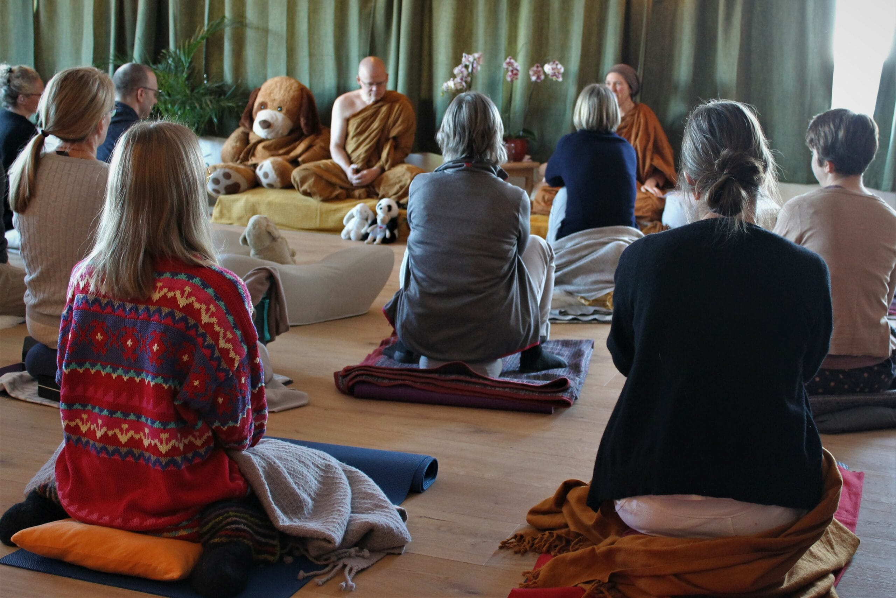
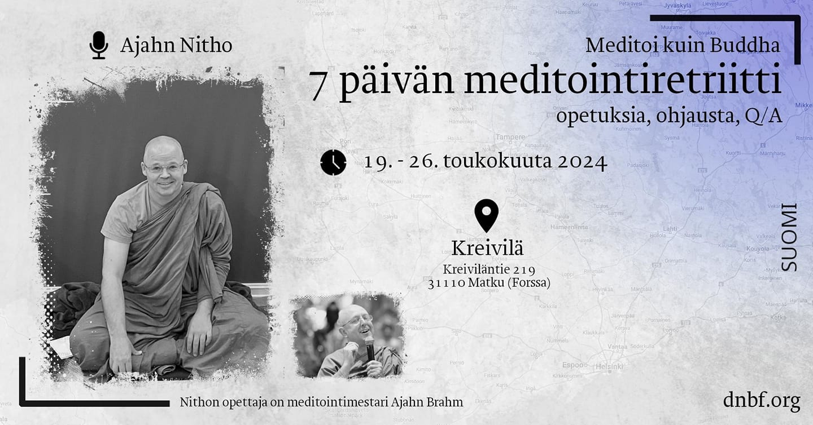

Kaikki haluavat meditoida, mutta miten se oikein tapahtuu?

Buddhan opetuksissa teoria ja käytäntö lyövät kättä. Opetuksien ymmärtäminen antaa pohjan meditoinnille. Tällä sivustolla tutkimme <a href="https://meditoikuinbuddha.github.io/blog/kukabuddhaoli">Buddhan alkuperäisiä opetuksia</a>. Lisäksi ääneen pääsevät kokeneet buddhalaiset opettajat. 

Sivusto on täysin ilmainen, ja kaikki materiaali julkaistaan selkeällä suomen kielellä.

Tavoitteemme on siis oppia meditoimaan kuin Buddha. Tule mukaan!

Meditoi kuin Buddha -yhteisö toimii norjalaisen The Buddhist Society of Norwayn alaisuudessa. 

Jos olet kiinnostunut Suomen paikallistoimintaan osallistumisesta, pistä viestiä osoitteeseen tampere@dnbf.org. Lue lisää järjestöstä ja muista Pohjoismaissa toimivista paikallisryhmistä: <a href="https://www.dnbf.org/en">DNBF.org</a>.

Ilmoittaudu englanninkieliselle retriitille! Paikkoja rajoitetusti. Lue lisää:

