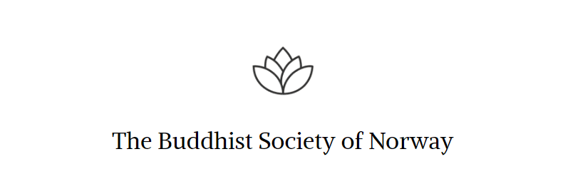

<figure>

  <figcaption>Kuva: <a href="https://readingfaithfully.org">ReadingFaithfully.org</a></figcaption>
</figure>

Kaikki haluavat meditoida, mutta miten se oikein tapahtuu?

Buddhalaisessa harjoituksessa teoria ja käytäntö lyövät kättä. Tällä sivustolla tutkitaan <a href="https://meditoikuinbuddha.fi/kukabuddhaoli">Buddhan alkuperäisiä opetuksia</a> ystävällisyydestä, rauhasta ja viisaudesta. Päämääränä on oppia meditoimaan kuin Buddha.

Sivustolla ääneen pääsevät myös <a href="https://meditoikuinbuddha.fi/categories/puheenvuoro">kokeneet buddhalaiset opettajat</a>, minkä lisäksi kerromme <a href="https://meditoikuinbuddha.fi/categories/ajankohtaista">tulevista tapahtumista</a>, joissa Buddhan opetuksia pistetään käytäntöön.

Sivusto on täysin ilmainen ja vapaa mainoksista.

<a href="https://www.vecteezy.com/free-vector/lotus">Lotus Vectors by Vecteezy</a>

Meditoikuinbuddha.fi tekee yhteistyötä norjalaisen <a href="https://www.dnbf.org/en">The Buddhist Society of Norwayn</a> kanssa, jolla on oma paikallisryhmä Tampereella.

Jos olet kiinnostunut Suomen paikallistoimintaan osallistumisesta, pistä viestiä osoitteeseen tampere@dnbf.org. 

